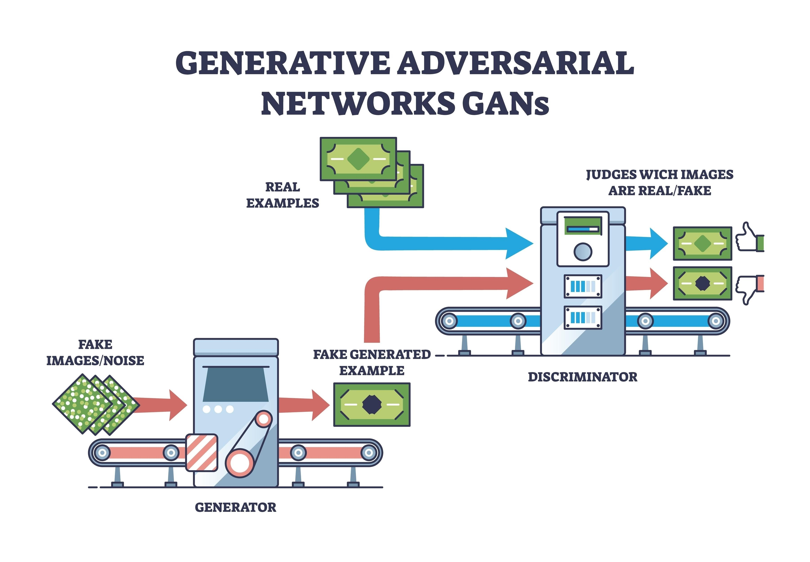

# Deep-Convolutional-GANs-DCGAN-

The goal remains the same: A Forger (Generator) tries to create fake images, and a Detective (Discriminator) tries to catch them. Over time, the Forger learns to create images so realistic that the Detective can't tell the difference.


## 🚀 Project Description

This assignment implements a Deep Convolutional Generative Adversarial Network (DCGAN) as described in the seminal paper by Radford et al. The goal is to generate realistic RGB images (64x64 pixels) from random noise.

Key Features:

- Convolutional Architecture: Unlike simple linear GANs, this model uses Conv2d (Discriminator) and ConvTranspose2d (Generator) layers. This preserves spatial coherence, allowing the model to generate sharper images.

- Batch Normalization: Applied after convolutional layers to stabilize learning and prevent the model from getting "stuck" (mode collapse).

- Strided Convolutions: Used instead of pooling layers to allow the network to learn its own spatial downsampling and upsampling.

## 🛠️ Installation & Requirements

This project runs in a Jupyter Notebook environment. A GPU is highly recommended for training.

Dependencies:
```
Python 3.x
PyTorch & Torchvision
Matplotlib (for visualization and animation)
NumPy
```

Installation:

```pip install torch torchvision matplotlib numpy```

📂 Project Structure
```bash
├── notebooks/
│   └── Assignment 2 Convolutional GANs.ipynb  # Main DCGAN implementation
├── output/
│   └── generated_grid.png                     # Grid of synthesized images
├── README.md
```
## ⚙️ Configuration & Hyperparameters

The model is configured with the following parameters standard for DCGAN stability:

- Image Size: 64x64 pixels

- Channels: 3 (RGB)

- Batch Size: 128

- Latent Vector Size ($z$): 100 (The size of the random "noise" input)

- Generator Feature Map Depth: 64

- Discriminator Feature Map Depth: 64

## 📝 Usage

To replicate the experiment:

1. Setup: Run the import cells to load libraries and define the hyperparameters.

2. Initialize Weights: The model uses a specific weight initialization (mean=0, std=0.02) crucial for DCGAN convergence.

3. Train: Run the training loop. The notebook will output:

- Loss values: Watch for the Generator (Loss_G) and Discriminator (Loss_D) to stabilize.

- Progress: The code generates a 64-image grid periodically to show improvement.

4. Visualize: The final cells create an animation or a static plot showing how the generated images evolved from pure static to recognizable forms.